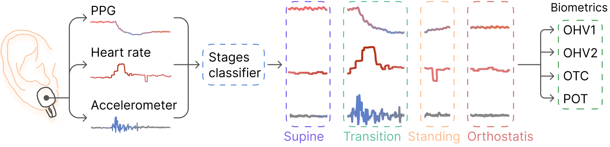

<h1 align="center">Deriving Biometrics for Orthostatic Hypotension</h1>
<p align="center"><i>The official implementation of Alina Muliak's Thesis under the supervision of Amar Basu submitted in fulfillment of the requirements
for the degree of Bachelor of Science in the Department of Computer Sciences and Information Technologies Faculty of Applied Sciences.</i></p>

<p align="center">
  
  
  
  
  
  
</p>

---

This repository is the official implementation of Bachelor Thesis on Deriving Biometrics for Orthostatic Hypotension (OH).
The proposed approach involves classifying the signals during stand-up tests into four phases: supine, transition,
standing, and orthostasis. The classified phases are then used to calculate the biometrics, which indicate the severity
of the OH in a patient.


[//]: # (>📋  Optional: include a graphic explaining your approach/main result, bibtex entry, link to demos, blog posts and tutorials)

To run and test our code, follow the steps below.


## Set up ⚙️

- `git clone <repo> https://github.com/alinamuliak/deriving-biometrics-for-oh.git`
- `cd deriving-biometrics-for-oh`
- `pip install virtualenv`, if `virtualenv` is not installed yet
- `virtualenv venv`
- `source venv/bin/activate` on Unix system; `venv\Scripts\activate` on Windows
- `pip install -r requirements.txt`

If you have CUDA available on your laptop, download `torch` from the [PyTorch official site](https://pytorch.org/get-started/locally/),
choosing your specific settings. If the CUDA is available, it will be used by default. Otherwise, the CPU will be used.
For instance, using Windows with CUDA 11.8, execute:
```setup
pip3 install torch torchvision torchaudio --index-url https://download.pytorch.org/whl/cu118
```

## Training 🗂

For each type of the models, a separate training script is used,
because of lot different parameters between the models.

| Model  | Script name     |
|--------|-----------------|
| CNN    | train_cnn.py    |
| LSTM   | train_lstm.py   |
| Hybrid | train_hybrid.py |

To see more detailed description about each parameter, run `python train_<model>.py --help` or `python train_<model>.py -h`.
All the parameters are optional and if not provided, the default values from the thesis will be used.

### CNN
To train the CNN model, run this command:

```train
python train_cnn.py [-h] [--batch_size BATCH_SIZE] [--n_conv_blocks N_CONV_BLOCKS]
                    [--out_channels OUT_CHANNELS] [--dropout DROPOUT] [--learning_rate LEARNING_RATE]
                    [--weight_decay WEIGHT_DECAY] [--num_epochs NUM_EPOCHS] [--verbose] [--model_name MODEL_NAME]
```

### LSTMs
To train the LSTM model, run this command:

```train
python train_lstm.py [-h] [--batch_size BATCH_SIZE] [--bidirectional] [--num_layers NUM_LAYERS]
                     [--hidden_size HIDDEN_SIZE] [--dropout DROPOUT] [--learning_rate LEARNING_RATE]
                     [--weight_decay WEIGHT_DECAY] [--num_epochs NUM_EPOCHS]
                     [--verbose] [--model_name MODEL_NAME]
```

### Hybrid CNN+LSTM
To train the hybrid model, run this command:

```train
python train_hybrid.py [-h] [--n_conv_blocks N_CONV_BLOCKS] [--cnn_out_channels CNN_OUT_CHANNELS]
                       [--cnn_dropout CNN_DROPOUT] [--lstm_bidirectional] [--lstm_num_layers LSTM_NUM_LAYERS]
                       [--lstm_hidden_size LSTM_HIDDEN_SIZE] [--lstm_dropout LSTM_DROPOUT]
                       [--learning_rate LEARNING_RATE] [--weight_decay WEIGHT_DECAY] [--num_epochs NUM_EPOCHS]
                       [--verbose] [--model_name MODEL_NAME]
```

## Evaluation

To evaluate the model on test dataset, run:

```eval
python eval.py [-h] --model_type {cnn,lstm,hybrid} --model_path MODEL_PATH --batch_size BATCH_SIZE
```

>📋  Describe how to evaluate the trained models on benchmarks reported in the paper, give commands that produce the results (section below).

## Pre-trained Models

You can find pretrained models in [models](models) directory,
where the name of the file corresponds with the model used.

- [CNN](models/cnn.pt) trained using the following parameters: 2 convolution blocks, kernel size of 32, dropout of 0.5, learning rate of 5e-05, weight decay of 0.0005 and 298 epochs. 
- [UniLSTM](models/unilistm-w-augmented.pt) trained using the following parameters: 2 layers with hidden size 231, dropout of 0.583, learning rate of 0.0005, weight decay 9e-06 and 1110 epochs.
- [BiLSTM](models/bilstm.pt) trained using the following parameters: 2 layers with hidden size of 200, dropout of 0.65, learning rate of 0.001, weight decay of 7.5e-05 and 899 epochs.
- [Hybrid](models/hybrid.pt) trained using the following parameters: 2 convolution blocks, CNN kernel size of 32, CNN dropout of 0.388, Bidirectional LSTM, 3 LSTM layers with hidden size of 174, LSTM dropout of 0.269, learning rate of 0.00973, weight decay of 7e-05 and 250 epochs.

[//]: # (>📋  Give a link to where/how the pretrained models can be downloaded and how they were trained &#40;if applicable&#41;.  Alternatively you can have an additional column in your results table with a link to the models.)


## Results

The achieved performance metrics for each model are presented in the tables below.
The best model was hybrid, which achieved F1-score of 91.9% on the test dataset.

| Model        | Accuracy    | F1-score    |
|--------------|-------------|-------------|
| CNN          | 71.4\%      | 71.1\%      |
| UniLSTM      | 86.0\%      | 86.9\%      |
| BiLSTM       | 84.4\%      | 85.7\%      |
| Hybrid model | **91.4\%**  | **91.9\%**  |

| Biometric MAE / Model | OHV1        | OHV1 normalized | OHV2       | OHV2 normalized | OTC [sec]  | POT [bpm] |
|-----------------------|-------------|-----------------|------------|-----------------|------------|-----------|
| CNN                   | 344.98      | 0.16            | 574.8      | 0.21            | 9.72       | 17.18     |
| UniLSTM               | 379.54      | 0.14            | 195.35     | 0.06            | 6.86       | 20.76     |
| BiLSTM                | 194.54      | 0.09            | **55.0**   | **0.01**        | 20.51      | **11.48** |
| Hybrid                | **85.37**   | **0.07**        | 90.0       | 0.06            | **4.06**   | 16.52     |


## Contributors

- [Alina Muliak](https://github.com/alinamuliak)
- Amar Basu

---
💡 README template from [here](https://github.com/paperswithcode/releasing-research-code/blob/master/templates/README.md).